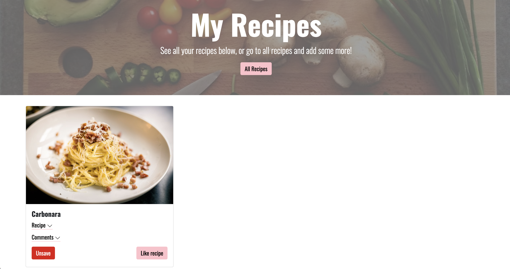

# Project name: T44 Capstone Project

<a name="description"/>

## Description 
A project demonstrating use of localStorage and Javascript to allow users to save, comment and like recipes 

## Table of contents 
- [Description](#description)  
- [Installation](#installation)
- [Usage](#usage)
- [Credits](#credits)

<a name="installation"/>

## Installation
You can clone this file directly to a local repository or download the code as a zip file. There are no dependencies or package files to manage

<a name="usage"/>

## Usage
The index page includes a button to navigate to the available recipes in the website 

The recipes page includes a list of recipes. Users can add them to their favourites and like the recipes 

The my recipes page includes a list of recipes the user has saved. Users can then add comments to their recipes, unsave or unlike recipes

The comments page allows the user to input fake comments. 

<a name="credits"/>

## Credits 
Author: Sam Glover 
